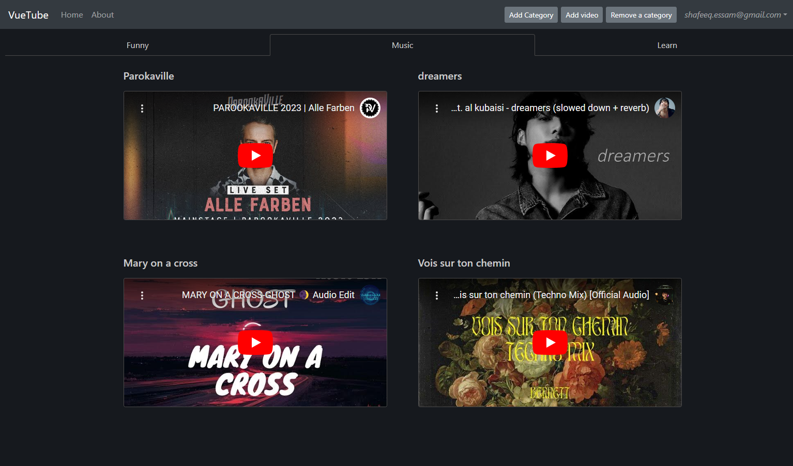

# Vuetube
Vuetube is a simple project to learn and practice Vue js, Vuex state management, Bootstrap 4, and Firebase.
In this app you can save videos in categories to find them quickly later.

## Demo
https://vuetube-1199b.firebaseapp.com/


## Config
You only need to add your web app's Firebase configuration to ` ./src/firebase.js`


## 📸 Screenshots



## Build Setup
``` bash
# install dependencies
npm install

# serve with hot reload at localhost:8080
npm run serve

# build for production with minification
npm run build

# build & deploy on firebase
npm run deploy
```
